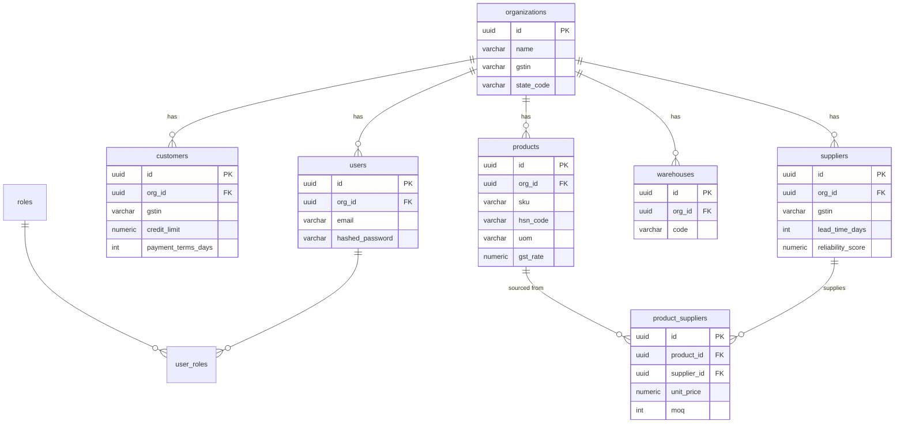
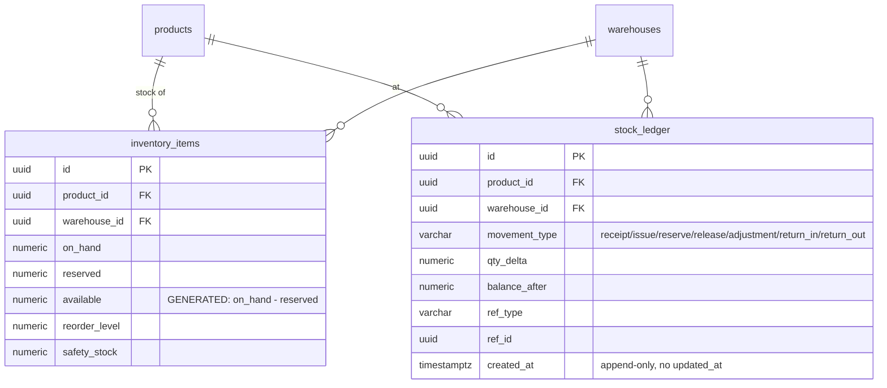
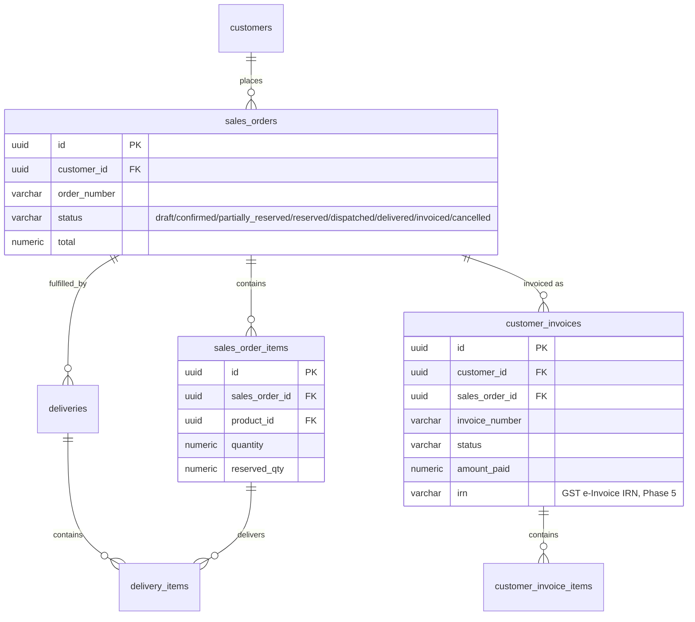
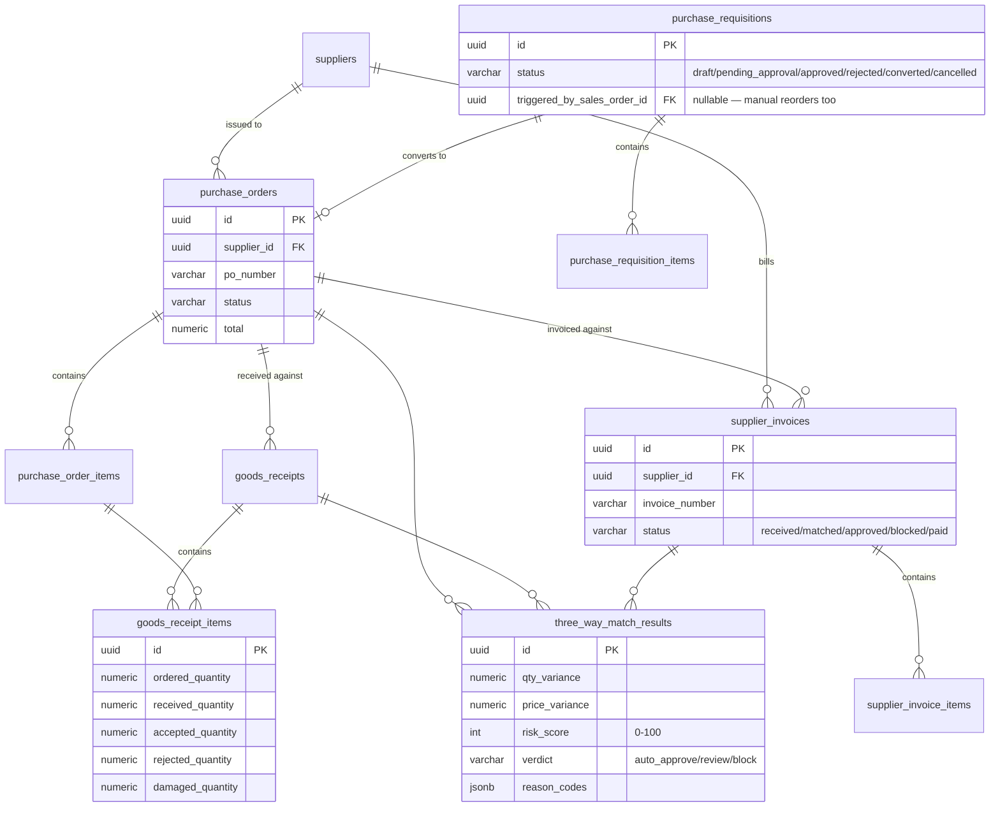
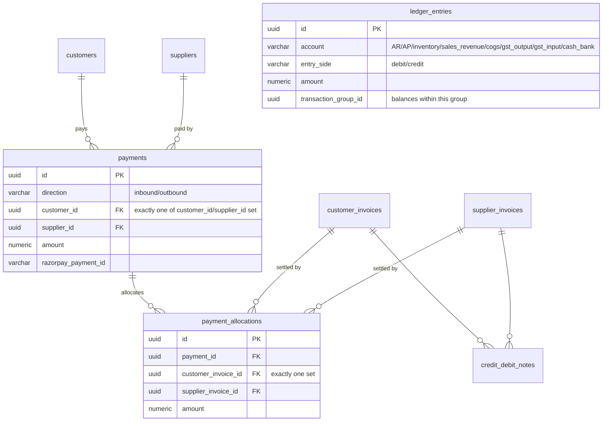
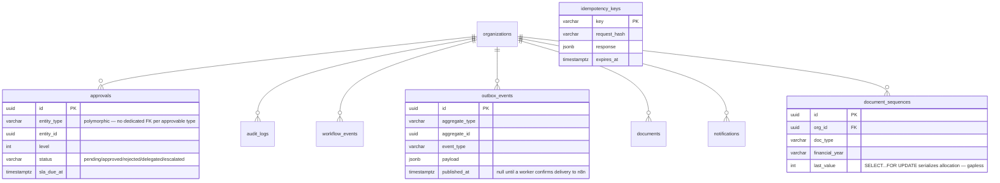

# VyaparaFlow AI — Entity Relationship Diagram

Phase 1 domain model. 38 tables, grouped by the same sections as
`roadmap.txt` Phase 1. Types are the actual Postgres types from the
SQLAlchemy models in `backend/app/db/models/`.

## Master data

## Inventory — the load-bearing design decision

`inventory_items` is the current-state snapshot; `stock_ledger` is the
append-only audit trail everything reconciles against. **Application code
never UPDATEs `on_hand`/`reserved` directly** — every change is a ledger
row written inside the same transaction (enforced in `services/inventory.py`,
Phase 2, not the DB — Postgres can't require "this UPDATE must be
accompanied by an INSERT elsewhere" without a trigger, which is deferred
until it proves necessary).

## Sales side (Order-to-Cash)

## Purchase side (Procure-to-Pay)

`goods_receipt_items` carries all four quantities separately (ordered,
received, accepted, rejected, damaged) per the roadmap's explicit
requirement — a shipment of 50 with 48 accepted and 2 damaged is not
collapsed into a single "received 48" number; the disposition is preserved.

## Money

`ledger_entries` is double-entry: every business event posts a balanced set
of rows (`sum(debit) == sum(credit)` within one `transaction_group_id`) —
separate from `stock_ledger`, which tracks physical units, not money.

## Cross-cutting

## Constraints worth calling out (not visible in the diagrams above)

- `ck_inventory_items_reserved_lte_on_hand`: `reserved <= on_hand` — can
  never reserve more than physically present.
- `ck_grn_items_disposition_sums_lte_received`:
  `accepted + rejected + damaged <= received_quantity`.
- `ck_payments_single_party` / `ck_payment_allocations_single_invoice`:
  exactly one of the two nullable FK columns is set (Postgres boolean-cast
  arithmetic: `(a IS NOT NULL)::int + (b IS NOT NULL)::int = 1`).
- GSTIN columns: format-checked by regex CHECK (nullable — unregistered
  "URP" counterparties are valid), not full checksum validation (that's an
  app-layer concern, Phase 4).
- Every status column is a `CHECK (... IN (...))` against a Python
  `StrEnum` in `app/db/models/enums.py`, not a native Postgres `ENUM` type
  — adding a new status later is a plain migration, not an `ALTER TYPE`.
